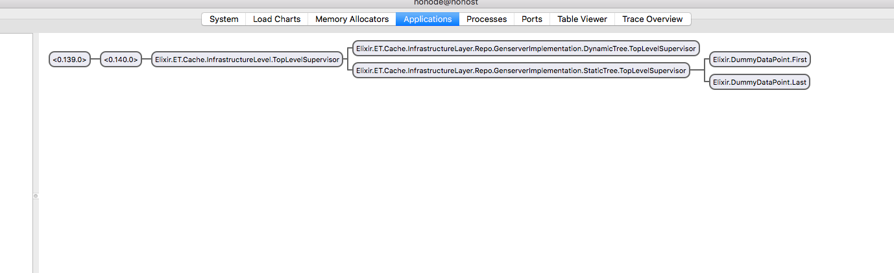
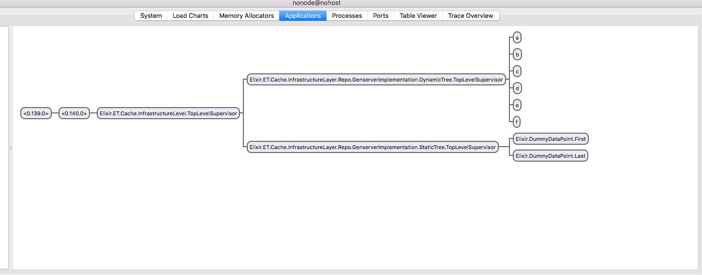
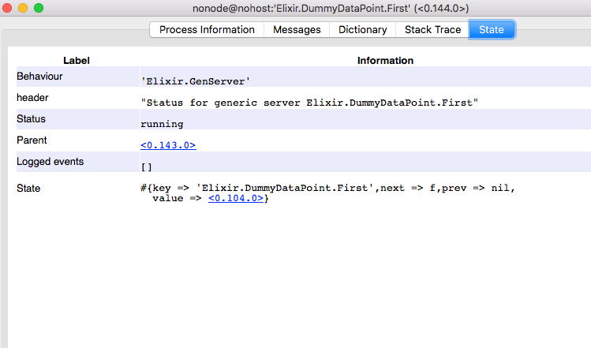
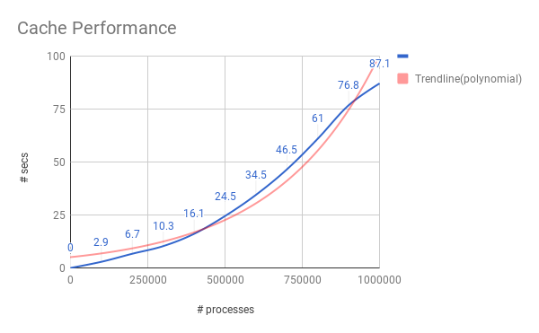
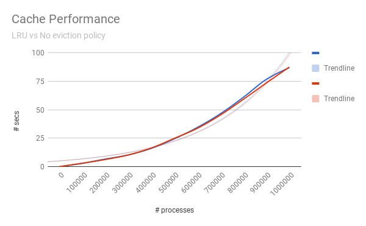
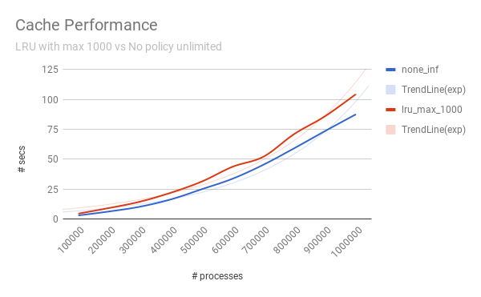

# Ephemeral Transcendence - a (distributed) cache solution with love from Elixir.

It is `Ephemeral`

*Because some things aren't meant to last...*

because state is only persisted on a fleeting basis.

It is `Transcendence`

*Because some things are meant to remain...*

because state is not contingent on the existence of one node only. It is to be replicated accross other nodes for fault tolerance on a distributed level.

*Disclaimer*: The distribution part still needs to get started : )

## Domain Driven Design - DDD
This is primarily a collaboration strategy between business and IT that seeks to establish a ubiquitous language against which software can be modelled against.

Thise project contains three distinct layers:
1. Application Layer
2. Domain Layer
3. Infrastructure Layer

Domain Layer is to contain all the business logic and is where the modelling takes place. It seeks to remain agnostic of questions related to infrastructure. It delegates to Infrastructure layer to do a "dumb" peristence.

Infrastructure layer in our case seeks to mitigate between the Domain Layer and the way data gets stored. Today it is realizing a caching solution leveraging GenServer processes and a Supervision tree. Tomorrow it may leverage this with ETS tables instead.

Application Layer is currently empty as there is no focus on having this operational as an API to communicate with the outside world.

These abstractions allow the software developer to explore various alternatives early on in the architecture, benchmark/load test them so that bottlenecks can be addressed early on.

It is for this reason, a focus has been made on "proof of concept"-benchmarking. More of that below.

## LRU Implementation

The best way to implement a cache with LRU eviction policy is:
1. For retrieval and storage, a hash table to attain O(1) performance. This can be done in Elixir using ETS or potentially GenServer processes in a Supervision tree. The latter approach is what has been opted for, where the key is used as the name of the process, and the state of the process is to contain the value associated with that key.
2. For LRU policy tracking, a doubly linked list, again to atain O(1) performance. In the case of an insert, you simply prepend to the first, so it now becomes the second and update the pointers accordingly. In the case of a retrieval/update, you use the hash table to point you directly to the relevant location inside the doubly linked list, take out the relevant item and fix the gap by establishing a connection between previous and next, prepend the current one to the doubly linked list as mentioned before. In the case you need to prepend but the threshold has been reached, then first go to the last item in the doubly linked list and delete accordingly.
This behaviour has been emulated in my current implementation by embedding meta data to each data point, e.g. `next` and `prev`. Whenever any CRUD action needs to be performed, this meta data is adjusted accordingly. This is a better alternative to keeping track of the eviction policy using a `list` for example, as that would lead to O(n) worst case behaviour, which in the case of a million items is expected to be highly problematic.

To demonstrate this more clearly, using `:observer.start`, the following depicts a fresh start of the topology of the application when doing `iex -S mix`.

Above you can see that the application starts up with a plain `TopLevel` Supervisor, which branches out to two children:
1. a `DynamicTree`, currently empty
2. a `StaticTree`, having two dummy items, `First` and `Last` to represent the start and end of the LRU eviction policy respectively.
The only purpose of these two items is to maintain meta data, e.g. `next` and `prev` so I can prepend and delete from the end of the list with O(1) complexity.

The `DynamicTree` is to house all the `GenServer` processes that deal with user data, as a key value store. The following is a depiction of how the topology changes to this dynamic behaviour.

And here is a screenshot of how the state of `DummyDataPoint.First` has changed accordingly, point now to `process` `f` as that was the last inserted key - value:

An important advantage for leveraging the current strategy is that it would be rather trivial to implement for instance `TTL` as an eviction policy, something that is more difficult to realize with an `ETS` based solution.

## Performance

Modify `max` amount processes under server_test
`iex --erl "+P 5000000" -S mix test test/server_test.exs:60`

The following is a graph that depicts cache performance for the LRU eviction policy, with an infinite threshold.
This means that no keys are evicted, and the latest inserted key will be the most recently used.
This is contrasted with an exponential trendline in the background to better visually depict the performance degradation over volume(e.g. # processes)

In order to establish if this trend is a fundamental constraint on the infrastructure layer or if it is the way the cache has been implemented on a domain layer level, the above behaviour has been contrasted with a benchmark when the eviction policy was disabled altogether. This means that we are dealing with a dumb insert only. As can be seen, both are quasi identical:

Next, the same benchmark was contrasted to when a threshold of `1000` was crossed. This means that after `1000`, the LRU eviction policy will cause to only retain the `1000` most recently used data points, discarding the older ones.
The shape of the curve has not fundamentally changed. It has rather rotated a bit, which makes sense given the architecture.

## Roadmap

Going forward, the following matters still need to be addressed:
1. Better abstraction of lru eviction policy.
2. Implementation of an `update`. Currently updates are not yet supported.
3. After the above, more elaborate testing, especially the potential impact that concurrency may bring in throwing the LRU eviction policy off balance when updates get made to the meta data.
4. Implementation of ETS based solution, which should only affect my Infrastructure Layer. I should not have to change the Domain Layer in any way.
5. Introduce better benchmarking standards as currently I have employed a very naive way of establishing them.
6. Implement other eviction policies.
7. Bring transcendence into the equation by multinode replication.
8. A very important flaw in current implementation is to use atoms as keys, which is bad as they are user supplied and can end up crashing the node. This needs to be replaced with a registry that uses strings as keys instead.